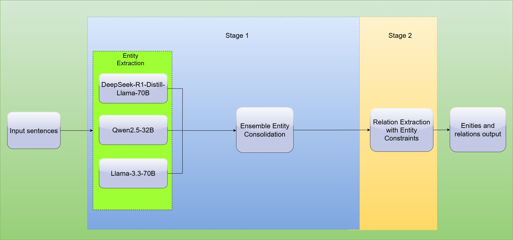

# ZeroSemble: Robust and Efficient Zero-Shot Document Information Extraction with Heterogeneous LLM Ensembles

This repository contains the official implementation for our paper "ZeroSemble: Robust and Efficient Zero-Shot Document Information Extraction with Heterogeneous LLM Ensembles" accepted at XLLM @ ACL 2025 Shared Task-IV: Universal Document-level Information Extraction (DocIE).


## Overview

ZeroSemble is a zero-shot ensemble approach that leverages multiple large language models to extract entities and relations from documents without domain-specific training. Our system achieved top performance in the XLLM @ ACL 2025 Shared Task-IV: Universal Document-level Information Extraction (DocIE).



### Key Features

- **Zero-Shot Extraction**: No domain-specific training required
- **Heterogeneous LLM Ensemble**: Combines DeepSeek R1, Llama-3.3-70B, and Qwen-2.5-32B
- **Two-Stage Pipeline**: Entity extraction followed by relation extraction with entity constraints
- **Multi-Domain Capability**: Performs consistently across 34 domains in the DocIE dataset

## Installation

```bash
# Clone the repository
git clone https://github.com/your-username/zerosemble.git
cd zerosemble

# Create and activate a virtual environment
python -m venv venv
source venv/bin/activate  # On Windows: venv\Scripts\activate

# Install dependencies
pip install -r requirements.txt

# Set up API keys (required for LLM access)
cp .env.example .env
# Edit .env with your API keys
```

## Code Structure

```
src-code/
├── combine.py              # Entity ensemble consolidation implementation
├── llm-approach.ipynb      # Core pipeline implementation and API handling
├── llm-zeroshot-entities.ipynb  # Stage 1: Entity extraction implementation
├── llm-zeroshot-triples.ipynb   # Stage 2: Relation extraction with entity constraints
├── utils/
│   ├── api_utils.py        # API handling utilities with error recovery
│   ├── processing.py       # Data preprocessing utilities
│   └── evaluation.py       # Evaluation metrics calculation
├── examples/               # Example input/output documents
└── results/                # Output results and analysis
```

## Usage

### 1. Entity Extraction (Stage 1)

Run the entity extraction stage to extract entities using three different LLMs:

```bash
python run_entity_extraction.py --input_dir data/raw --output_dir results/entities
```

Alternatively, you can use the provided Jupyter notebook:

```bash
jupyter notebook llm-zeroshot-entities.ipynb
```

### 2. Entity Ensemble

Combine and consolidate entity outputs from the three models:

```bash
python combine.py --input_dir results/entities --output_dir results/ensemble
```

### 3. Relation Extraction with Entity Constraints (Stage 2)

Extract relations using the consolidated entity set:

```bash
python run_relation_extraction.py --entities_dir results/ensemble --output_dir results/final
```

Alternatively, use the provided Jupyter notebook:

```bash
jupyter notebook llm-zeroshot-triples.ipynb
```

## Implementation Details

### API Management

Our implementation includes robust error handling and API key cycling to handle large document batches:

```python
# Example from llm-approach.ipynb
def query_groq_api(prompt, model="deepseek-r1-distill-llama-70b", retry_count=0, max_retries=5):
    try:
        response = client.chat.completions.create(
            model=model,
            messages=[{"role": "user", "content": prompt}],
            temperature=0.1,
            max_tokens=4096
        )
        return response.choices[0].message.content
    except Exception as e:
        if retry_count < max_retries:
            print(f"Error: {e}. Retrying ({retry_count+1}/{max_retries})...")
            time.sleep(2 ** retry_count)  # Exponential backoff
            return query_groq_api(prompt, model, retry_count+1, max_retries)
        else:
            print(f"Failed after {max_retries} retries: {e}")
            return None
```
*NOTE: We have known that qwen 2.5-32b has been deleted by Groq few days ago. If you want to get the result file of qwen 2.5, you can use our result.json in attempts/qwen-2.5/results.json
### Entity Consolidation

The `combine.py` script implements our entity consolidation algorithm, which handles:

- Entity deduplication using frozensets
- Entity type resolution through majority voting
- Mention consolidation for improved recall

### Entity-Constrained Relation Extraction

The key innovation in our approach is using consolidated entities as context for relation extraction. The prompt structure in `llm-zeroshot-triples.ipynb` shows this implementation:

```python
def generate_relation_prompt(document, entities_list, doc_id):
    prompt = f"""
    You are an advanced information extraction model specializing in Relation Extraction (RE). 
    Your specific domain is {document['domain']}.
    Extract relationships from the given document with a focus on the provided entities. 
    Based on the document id '{doc_id}' and its corresponding entities {entities_list}, 
    please identify the relation triples where the 'head' and 'tail' are among these entities.
    Return only the extracted JSON output without any extra text.
    Extract relevant named entities and their relationships based on predefined RE labels.
    Try to find exactly.
    
    ### Input:
    {json.dumps(document, ensure_ascii=False)}
    
    ### Output Format:
    {{
        "{doc_id}": {{
            "title": "{document['title']}",
            "triples": [
                {{
                    "head": "<Entity 1>",
                    "relation": "<Relationship>",
                    "tail": "<Entity 2>"
                }}
            ]
        }}
    }}
    """
    return prompt
```

## Dataset

The DocIE dataset includes 34 diverse domains. You can download it from the official shared task website:
[XLLM @ ACL 2025 Shared Task-IV](https://xllms.github.io/DocIE/)

## Results

Our approach achieved top-2 performance in the DocIE shared task with balanced results across entity and relation extraction:

| Metric     | Score (%) |
|------------|-------|
| F1_EI      | 55.65 |
| F1_EC      | 26.11 |
| F1_REG     | 4.19  |
| F1_RES     | 4.01  |
| Overall F1 | 22.49 |
## Citation

If you find our work useful, please cite our paper:

```bibtex
@inproceedings{le-etal-2025-docie,
    title = "{D}oc{IE}@{XLLM}25: {Z}ero{S}emble - Robust and Efficient Zero-Shot Document Information Extraction with Heterogeneous Large Language Model Ensembles",
    author = "Pham Hoang Le, Nguyen  and
      Dinh Thien, An  and
      T. Luu, Son  and
      Van Nguyen, Kiet",
    editor = "Fei, Hao  and
      Tu, Kewei  and
      Zhang, Yuhui  and
      Hu, Xiang  and
      Han, Wenjuan  and
      Jia, Zixia  and
      Zheng, Zilong  and
      Cao, Yixin  and
      Zhang, Meishan  and
      Lu, Wei  and
      Siddharth, N.  and
      {\O}vrelid, Lilja  and
      Xue, Nianwen  and
      Zhang, Yue",
    booktitle = "Proceedings of the 1st Joint Workshop on Large Language Models and Structure Modeling (XLLM 2025)",
    month = aug,
    year = "2025",
    address = "Vienna, Austria",
    publisher = "Association for Computational Linguistics",
    url = "https://aclanthology.org/2025.xllm-1.25/",
    doi = "10.18653/v1/2025.xllm-1.25",
    pages = "288--297",
    ISBN = "979-8-89176-286-2"
}
```

## License

This project is licensed under the MIT License - see the LICENSE file for details.

## Acknowledgments

- We thank the organizers of the XLLM @ ACL 2025 DocIE shared task
- We acknowledge the providers of the LLM APIs used in this work: DeepSeek, Meta, and Alibaba Cloud
