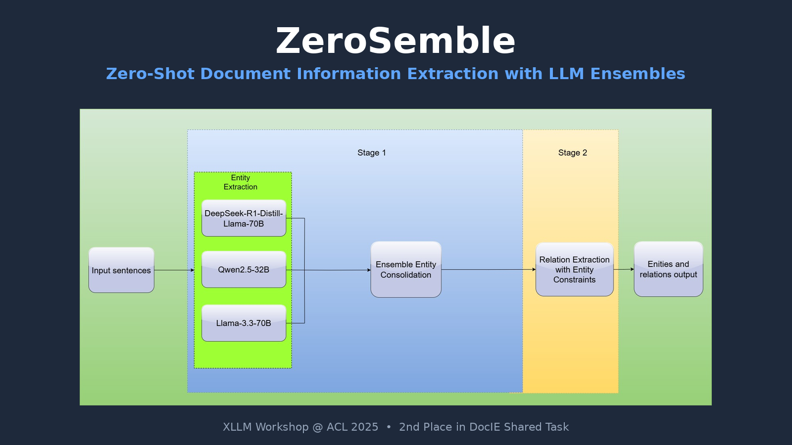
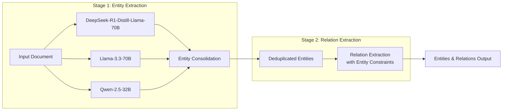

# ZeroSemble

**Zero-shot document-level entity and relation extraction using heterogeneous LLM ensembles**



## Overview

ZeroSemble is a two-stage, zero-shot system for document-level information extraction. It combines three large language models—**DeepSeek-R1-Distill-Llama-70B**, **Llama-3.3-70B**, and **Qwen-2.5-32B**—served via Groq, to extract entities and relations from documents without domain-specific training.

The approach achieved **2nd place** in the DocIE Shared Task at the XLLM Workshop @ ACL 2025 (Vienna), as team **UIT-SHAMROCK**.

### How It Works


```mermaid
flowchart LR
    subgraph Stage1[Stage 1: Entity Extraction]
        A[Input Document] --> B[DeepSeek-R1-Distill-Llama-70B]
        A --> C[Llama-3.3-70B]
        A --> D[Qwen-2.5-32B]
        B --> E[Entity Consolidation]
        C --> E
        D --> E
    end
    subgraph Stage2[Stage 2: Relation Extraction]
        E --> F[Deduplicated Entities]
        F --> G[Relation Extraction<br/>with Entity Constraints]
    end
    G --> H[Entities & Relations Output]
```

**Stage 1**: Each LLM independently extracts entities from the document. Outputs are consolidated using deduplication (frozenset-based) and majority-vote typing.

**Stage 2**: Relations are extracted using only the consolidated entity set as constraints, reducing hallucination and improving precision.

## Results

Final ensemble results on the DocIE test set:

| Metric | F1 (%) |
|--------|--------|
| Entity Identification (EI) | 55.65 |
| Entity Classification (EC) | 26.11 |
| Relation Extraction General (REG) | 4.19 |
| Relation Extraction Strict (RES) | 4.01 |
| **Overall** | **22.49** |

### Individual Model Performance

| Model | EI F1 | EC F1 | REG F1 | RES F1 |
|-------|-------|-------|--------|--------|
| DeepSeek-R1-Distill | 41.37 | 22.42 | 2.73 | 2.45 |
| Llama-3.3-70B | 45.09 | 24.60 | 4.75 | 4.42 |
| Qwen-2.5-32B | 36.49 | 18.65 | 3.92 | 3.84 |

The ensemble improved Entity Identification F1 by +10.56 percentage points over the best single model (Llama-3.3-70B).

## Repository Structure

```
├── src/
│   ├── api-calling/
│   │   ├── llm-zeroshot-entities-stage1.ipynb   # Stage 1: Entity extraction via Groq API
│   │   └── llm-zeroshot-triples-stage2.ipynb    # Stage 2: Relation extraction with entity constraints
│   ├── utils/
│   │   ├── combine.py                           # Entity ensemble consolidation
│   │   ├── analyze__data.py                     # Data analysis utilities
│   │   ├── scoring.py                           # Evaluation scoring
│   │   └── check_*.py / check_*.ipynb           # Validation scripts
│   ├── local-running/                           # Local inference with Hugging Face models
│   │   ├── run_extraction.py                    # Main extraction pipeline
│   │   ├── models/llm.py                        # Model management
│   │   ├── utils/ensemble.py                    # Ensemble utilities
│   │   └── inference/run_inference.py           # Inference logic
│   └── reports/
│       └── report.md                            # Detailed performance analysis
├── attempts/                                    # Experiment results per model
│   ├── deepseek/
│   ├── llama-3.3-70b-versatile/
│   ├── qwen-2.5/
│   └── last-result/                             # Final ensemble output
├── xllm.jpg                                     # Architecture diagram
└── README.md
```

## Usage

### Via Groq API (as used in the shared task)

1. Install dependencies:
   ```bash
   pip install groq
   ```

2. Run entity extraction (Stage 1):
   - Open `src/api-calling/llm-zeroshot-entities-stage1.ipynb`
   - Set your Groq API keys in the notebook
   - Execute to extract entities from each model

3. Consolidate entities:
   ```bash
   cd attempts
   python ../src/utils/combine.py
   ```

4. Run relation extraction (Stage 2):
   - Open `src/api-calling/llm-zeroshot-triples-stage2.ipynb`
   - Use the consolidated entity set as input

### Local Inference (requires GPU)

For running inference locally with Hugging Face models:

```bash
cd src/local-running

# Install dependencies
pip install torch transformers accelerate tqdm

# Run extraction on your documents
python run_extraction.py --input /path/to/documents.json --output ./results --verbose
```

**Requirements**:
- CUDA-capable GPU with ≥24GB VRAM (single model) or ≥40GB (all three)
- ~100GB disk space for model weights
- Hugging Face authentication for gated models

See `src/local-running/README.md` for detailed usage.

## Data

The DocIE dataset from the XLLM @ ACL 2025 Shared Task includes documents across 34 domains. Download it from the [official shared task page](https://xllms.github.io/DocIE/).

Note: `reference.json` in this repository is listed in `.gitignore` and not tracked.

## Team

**UIT-SHAMROCK** (University of Information Technology, VNU-HCM):
- Nguyen Pham Hoang Le
- An Dinh Thien
- Son T. Luu
- Kiet Van Nguyen

## Citation

```bibtex
@inproceedings{le-etal-2025-docie,
    title     = "{D}oc{IE}@{XLLM}25: {Z}ero{S}emble - Robust and Efficient Zero-Shot Document Information Extraction with Heterogeneous Large Language Model Ensembles",
    author    = "Pham Hoang Le, Nguyen and Dinh Thien, An and T. Luu, Son and Van Nguyen, Kiet",
    booktitle = "Proceedings of the 1st Joint Workshop on Large Language Models and Structure Modeling (XLLM 2025)",
    month     = aug,
    year      = "2025",
    address   = "Vienna, Austria",
    publisher = "Association for Computational Linguistics",
    url       = "https://aclanthology.org/2025.xllm-1.25/",
    doi       = "10.18653/v1/2025.xllm-1.25",
    pages     = "288--297",
}
```

## License

License: not yet specified.

## Acknowledgments

- Organizers of the XLLM @ ACL 2025 DocIE Shared Task
- Groq for API access during the competition
- The teams behind DeepSeek, Llama, and Qwen

---

> **Note**: Qwen-2.5-32B has been removed from the Groq API. To reproduce results for that model, use the saved outputs in `attempts/qwen-2.5/results.json`.
